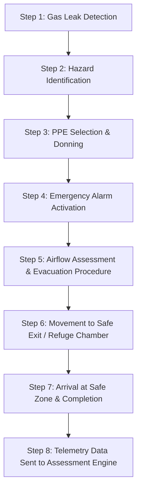

# Gas Leak Scenario Implementation Specification
**Project**: AR-Based Vocational Training Simulator for Industrial Safety (Jharkhand Mining & Manufacturing Sector)  
**Author**: Person 2 (3D Assets & Safety Scenario Lead)  
**Target Platform**: Mobile AR (Android / ARCore via Unity AR Foundation)  
**Document Version**: 1.0 (Day 1 Specification)

---

## 1. Scenario Overview

- **Scenario ID**: `SIM_GAS_LEAK_01`
- **Scenario Title**: Underground Mine / Industrial Plant Hazardous Gas Leak Evacuation
- **Target Sector**: Underground Coal & Metal Mining (e.g., Jharia, Dhanbad, Bokaro) and Chemical / Heavy Manufacturing Facilities (Jamshedpur, Ranchi).
- **Primary Hazard Context**: Ingress of toxic $CO$ (Carbon Monoxide) and flammable Methane ($CH_4$) in an underground shaft or plant processing bay, leading to oxygen displacement and explosive potential.
- **Training Objectives**:
  1. Detect visual/audio hazard indicators promptly.
  2. Perform gas concentration verification using a portable gas monitor.
  3. Select and don appropriate Personal Protective Equipment (SCBA / Self-Rescuer) over inappropriate gear (standard dust mask).
  4. Trigger the emergency manual call point alarm to alert co-workers.
  5. Read ventilation / wind sock airflow indicators to determine the safe upwind escape path.
  6. Evacuate along the designated fresh-air escape route to the Mine Safe Haven / Emergency Assembly Point.

> [!IMPORTANT]
> **Safety Standard Verification Notice**: The procedures specified in this module are based on Directorate General of Mines Safety (DGMS) Coal Mines Regulations 2017 (Regulations 169 & 170 regarding gas safety and self-rescuers) and standard industrial safety protocols (IS 15801 / OSHA 1910.120). Final deployment must be audited against specific plant standard operating procedures (SOPs).

---

## 2. Complete Step-by-Step Scenario Sequence



---

### Detailed Step Breakdown

#### Step 1: Gas Leak Detection
- **What Trainee Sees**: Trainee anchors AR mine tunnel environment. A subtle yellowish/gray gas haze appears near a flange joint, accompanied by a gas monitor status light changing from green to amber.
- **What Trainee Can Interact With**: Digital portable gas monitor on utility belt or nearby wall mount.
- **Correct Action**: Tap portable gas monitor to check gas reading ($CH_4 > 1.25\%$, $CO > 50\text{ ppm}$).
- **Incorrect Action**: Ignore the visual haze and continue walking forward into the contaminated zone.
- **What Happens After Action**: HUD updates with warning banner ("HAZARD DETECTED: ELEVATED GAS CONCENTRATION"); transitions to Step 2.
- **What Assessment Engine Records**:
  - `reactionTimeSeconds` (time from gas haze spawn to monitor check)
  - `stepId`: `STEP_01_DETECTION`
  - `isCorrect`: `true` / `false`
- **Required 3D/UI/Audio Assets**:
  - 3D: `pref_env_pipe_flange_01`, `pref_eq_gas_detector_01`
  - UI: Amber alert HUD card (`ui_alert_gas_amber.png`)
  - Audio: Hissing gas pipe sound (`sfx_gas_hissing.wav`)

---

#### Step 2: Warning Appears & Hazard Identification
- **What Trainee Sees**: Screen flashes amber overlay; warning text pops up: "WARNING: Toxic Gas Ingress Detected. Evaluate hazard level."
- **What Trainee Can Interact With**: Hazard identification modal on screen (Options: A. Dust Hazard, B. Toxic/Explosive Gas Leak, C. Water Seepage).
- **Correct Action**: Select Option B ("Toxic/Explosive Gas Leak").
- **Incorrect Action**: Select Option A or C (Incorrect diagnosis).
- **What Happens After Action**: System confirms hazard classification; transitions to Step 3 (PPE Selection).
- **What Assessment Engine Records**:
  - `stepId`: `STEP_02_HAZARD_ID`
  - `selectedOption`: `"TOXIC_GAS_LEAK"`
  - `isCorrect`: `true` / `false`
  - `penaltyPoints`: 0 for correct, 10 for incorrect.
- **Required 3D/UI/Audio Assets**:
  - UI: Interactive MCQ modal overlay (`ui_modal_hazard_id.png`)
  - Audio: UI selection click (`sfx_ui_click.wav`), hazard chime (`sfx_alert_chime.wav`)

---

#### Step 3: PPE Selection & Donning
- **What Trainee Sees**: A safety equipment rack appears in AR containing three gear items:
  1. Standard N95 Dust Mask
  2. Full-Face Self-Contained Breathing Apparatus (SCBA) / Chemical Respirator
  3. Welding Shield Mask
- **What Trainee Can Interact With**: 3D PPE items on the equipment stand.
- **Correct Action**: Select and don the Full-Face SCBA / Chemical Respirator.
- **Incorrect Action**: Select N95 Dust Mask or Welding Shield Mask.
- **Critical Unsafe Action**: Attempting to proceed past Step 3 without equipping any respirator (simulated oxygen deprivation / asphyxiation risk).
- **What Happens After Action**:
  - *Correct*: Trainee avatar HUD gains SCBA visor mask outline overlay; air flow audio activates; proceeds to Step 4.
  - *Incorrect*: Warning sound plays; HUD warns "INSUFFICIENT PROTECTION AGAINST GAS INGRESS"; user must retry.
- **What Assessment Engine Records**:
  - `stepId`: `STEP_03_PPE_SELECTION`
  - `selectedItemId`: `"ppe_scba_mask_01"`
  - `isCorrect`: `true` / `false`
  - `isCriticalHazard`: `true` if user selected dust mask or tried to bypass.
- **Required 3D/UI/Audio Assets**:
  - 3D: `pref_ppe_scba_mask_01`, `pref_ppe_dust_mask_01`, `pref_ppe_rack_01`
  - UI: SCBA Visor Overlay (`ui_scba_hud_overlay.png`)
  - Audio: SCBA breathing intake sound (`sfx_scba_breath.wav`), error buzz (`sfx_error_buzz.wav`)

---

#### Step 4: Emergency Response & Alarm Activation
- **What Trainee Sees**: Emergency Manual Call Point (MCP) alarm station on the tunnel wall with glass cover and pull lever / break glass hammer.
- **What Trainee Can Interact With**: 3D Manual Call Point switch (`pref_eq_alarm_switch_01`).
- **Correct Action**: Pull emergency alarm lever / tap "ACTIVATE EMERGENCY ALARM".
- **Incorrect Action**: Evacuate without triggering the alarm (fails co-worker warning protocol).
- **What Happens After Action**:
  - *Correct*: Red strobe light begins flashing on the alarm unit; high-decibel industrial siren begins sounding (`sfx_industrial_siren.wav`); evacuation status unlocked.
- **What Assessment Engine Records**:
  - `stepId`: `STEP_04_ALARM_ACTIVATION`
  - `alarmTriggeredTimestamp`: `float`
  - `isCorrect`: `true` / `false`
- **Required 3D/UI/Audio Assets**:
  - 3D: `pref_eq_alarm_switch_01`, `pref_fx_strobe_light_01`
  - UI: Alarm prompt notification (`ui_prompt_alarm.png`)
  - Audio: Industrial alarm siren loop (`sfx_industrial_siren.wav`)

---

#### Step 5: Airflow Assessment & Evacuation Procedure
- **What Trainee Sees**: An airflow ventilation ribbon / wind sock near the ceiling showing air direction flowing from West to East (towards contaminated zone). Directional escape signage markers on tunnel pillars.
- **What Trainee Can Interact With**: Wind sock indicator (`pref_env_windsock_01`) and directional arrows (Upwind vs Downwind path).
- **Correct Action**: Choose the UPWIND escape route (heading into fresh intake air, away from gas cloud movement).
- **Critical Unsafe Action**: Choosing the DOWNWIND path (travelling directly along the gas plume trajectory).
- **What Happens After Action**:
  - *Correct*: Screen updates: "CORRECT: Proceeding Upwind Along Intake Airway"; escape path waypoint marker activates.
  - *Critical Unsafe*: Visual gas opacity intensifies; toxicity meter spikes to 100%; scenario triggers "SIMULATED EXPOSURE FAILURE" and forces retry.
- **What Assessment Engine Records**:
  - `stepId`: `STEP_05_AIRFLOW_PROCEDURE`
  - `chosenDirection`: `"UPWIND"` / `"DOWNWIND"`
  - `isCorrect`: `true`
  - `isCriticalHazard`: `true` (if DOWNWIND chosen)
- **Required 3D/UI/Audio Assets**:
  - 3D: `pref_env_windsock_01`, `pref_env_sign_escape_01`
  - UI: Waypoint navigation HUD arrow (`ui_nav_arrow.png`)
  - Audio: Wind/ventilation shaft draft sound (`sfx_vent_draft.wav`)

---

#### Step 6: Movement Toward Safe / Approved Exit
- **What Trainee Sees**: AR ground floor navigation markers pointing toward the Mine Safe Haven / Emergency Refuge Chamber door. Gas particle density remains visible behind trainee.
- **What Trainee Can Interact With**: AR movement/tap target on floor near safe refuge door.
- **Correct Action**: Walk / move device towards designated safe zone marker, avoiding obstacles.
- **Incorrect Action**: Straying off designated escape route towards unventilated side tunnels.
- **What Happens After Action**: Trainee reaches within $1.5\text{ meters}$ radius of the Refuge Chamber doorway.
- **What Assessment Engine Records**:
  - `stepId`: `STEP_06_EVACUATION_MOVEMENT`
  - `evacuationPathDistanceMeters`: `float`
  - `timeToEvacuateSeconds`: `float`
- **Required 3D/UI/Audio Assets**:
  - 3D: `pref_env_refuge_door_01`, `pref_fx_floor_waypoint_01`
  - Audio: Heavy steel door opening sound (`sfx_door_open.wav`), running footsteps (`sfx_footsteps_mine.wav`)

---

#### Step 7: Safe Zone Arrival & Scenario Completion
- **What Trainee Sees**: Trainee enters green highlighted Safe Zone volume. Steel refuge door closes automatically. HUD switches from alarm red to safe green with completion summary: "SCENARIO COMPLETED - SAFE HAVEN REACHED".
- **What Trainee Can Interact With**: "VIEW ASSESSMENT SUMMARY" button on final AR dialogue card.
- **Correct Action**: Tap "FINISH SCENARIO".
- **What Happens After Action**: Final performance metrics (Time, Safety Accuracy %, Penalties) displayed; JSON payload transmitted to assessment system.
- **What Assessment Engine Records**:
  - `stepId`: `STEP_07_COMPLETED`
  - `totalScenarioTimeSeconds`: `float`
  - `finalComplianceScore`: `0-100%`
  - `passStatus`: `PASSED` / `FAILED`
- **Required 3D/UI/Audio Assets**:
  - 3D: `pref_env_safe_zone_marker_01`
  - UI: Completion modal summary (`ui_modal_completion.png`)
  - Audio: Success fanfare (`sfx_success_chime.wav`)

---

## 3. Required Objects & 3D Prefab Hierarchy

All 3D assets must be packaged as Unity Prefabs inside `Assets/Prefabs/GasLeak/` using the specified hierarchy:

```
pref_gas_leak_scenario_root
├── Environment/
│   ├── pref_env_mine_wall_section_01
│   ├── pref_env_pipe_flange_01
│   ├── pref_env_refuge_door_01
│   ├── pref_env_windsock_01
│   └── pref_env_sign_escape_01
├── Equipment/
│   ├── pref_eq_gas_detector_01
│   ├── pref_eq_alarm_switch_01
│   └── pref_ppe_rack_01
├── Interactivity/
│   ├── pref_ppe_scba_mask_01
│   └── pref_ppe_dust_mask_01
└── Effects/
    ├── pref_fx_gas_cloud_01 (Particle System)
    ├── pref_fx_strobe_light_01 (Flashing Point Light + Beacon mesh)
    └── pref_fx_floor_waypoint_01 (Unlit Animated AR Ring)
```

---

## 4. Interactions Matrix

| Object ID | Interaction Type | Gesture / Input | Visual Feedback | Audio Feedback |
| :--- | :--- | :--- | :--- | :--- |
| `pref_eq_gas_detector_01` | Inspect Monitor | Tap on mesh | Monitor screen zooms to HUD; numbers flash red | Beep code (`sfx_detector_beep.wav`) |
| `pref_ppe_scba_mask_01` | Select / Don PPE | Tap on SCBA mesh | Mask attaches to avatar HUD frame | SCBA air regulator click + breath sound |
| `pref_ppe_dust_mask_01` | Select PPE (Wrong) | Tap on Dust Mask | Red cross highlight; shake animation | Error buzz (`sfx_error_buzz.wav`) |
| `pref_eq_alarm_switch_01` | Pull Lever | Swipe down on lever | Lever flips $45^\circ$; red strobe light turns ON | Alarm siren loop (`sfx_industrial_siren.wav`) |
| `pref_env_windsock_01` | Check Air Flow | Raycast focus | Arrow overlay indicates wind vector | Air stream draft sound |
| `pref_fx_floor_waypoint_01`| Move to Location | AR Tap on ground | Green highlight ring pulse | Footstep audio (`sfx_footsteps_mine.wav`) |

---

## 5. Correct Actions vs. Wrong Actions vs. Critical Unsafe Actions

### A. Correct Actions Table
1. Checking portable gas detector immediately upon visual haze detection.
2. Identifying hazard correctly as "Toxic & Explosive Gas Leak".
3. Selecting full-face SCBA respirator over dust mask.
4. Activating emergency alarm call point before evacuating.
5. Evaluating windsock/ventilation indicator and choosing **upwind** path.
6. Evacuating directly to the certified Mine Refuge Chamber / Safe Haven.

### B. Wrong Actions (Non-Fatal Penalties: $-10\text{ pts}$)
1. Delays inspecting gas detector ($> 15\text{ seconds}$).
2. Misclassifying hazard as standard dust or steam.
3. Taking more than 2 attempts to locate emergency alarm switch.
4. Hesitating at airflow junction ($> 20\text{ seconds}$).

### C. Critical Unsafe Actions (Immediate Scenario Failure & Mandatory Re-training)
1. **Proceeding into contaminated zone without any PPE**: High asphyxiation risk ($CO > 400\text{ ppm}$).
2. **Equipping Dust Mask for Gas Leak**: Dust masks provide 0 protection against gaseous $CO / CH_4$.
3. **Evacuating Downwind**: Travelling with the gas plume leads to severe toxic exposure.
4. **Igniting open flame / turning non-intrinsically safe gear ON near $CH_4$ leak**: Explosive hazard in mine atmosphere.

---

## 6. Feedback System Matrix

```
                      ┌─────────────────────────────────┐
                      │     Trainee Action Input        │
                      └─────────────────────────────────┘
                                       │
            ┌──────────────────────────┴──────────────────────────┐
            ▼                                                     ▼
┌───────────────────────┐                             ┌───────────────────────┐
│     VALID / SAFE      │                             │   UNSAFE / INVALID    │
└───────────────────────┘                             └───────────────────────┘
            │                                                     │
            ├─ Visual: Green HUD ring & outline                   ├─ Visual: Flashing Red Banner & camera shake
            ├─ Audio: Success chime / SCBA flow                   ├─ Audio: High warning buzz & hazard siren
            └─ Haptic: Single clean pulse ($50\text{ ms}$)        └─ Haptic: Double heavy vibration ($200\text{ ms}$)
```

---

## 7. Unity Integration & Developer Notes (For Person 1)

### A. State Machine Pattern (C# Implementation Outline)
Person 1 should implement a clear State Machine pattern (`GasLeakScenarioController.cs`):

```csharp
// Unity C# Script Outline for Person 1 Integration
public enum GasLeakStep
{
    Detection = 1,
    HazardIdentification = 2,
    PpeSelection = 3,
    AlarmActivation = 4,
    AirflowProcedure = 5,
    EvacuationMovement = 6,
    SafeZoneCompleted = 7
}

public class GasLeakScenarioController : MonoBehaviour
{
    public GasLeakStep currentStep = GasLeakStep.Detection;

    public void AdvanceStep(GasLeakStep nextStep)
    {
        currentStep = nextStep;
        OnStepChanged(currentStep);
        SendTelemetryEvent(currentStep);
    }

    private void SendTelemetryEvent(GasLeakStep step)
    {
        // Formats JSON payload as defined in ARCHITECTURE.md and dispatches to assessment engine
    }
}
```

### B. Mobile AR Performance Recommendations for Unity Scene
1. **Lighting**: Set Light Mode to `Subtractive` or `Baked Indirect`. Use 1 Directional Light (Intensity 0.8) + Ambient Lighting.
2. **Particles**: Use `ParticleSystem` with Max Particles = 30, Texture Sheet Animation ($2 \times 2$ grid), Unlit Alpha Blended material.
3. **Shader**: Use Unity Universal Render Pipeline (URP) `Universal Render Pipeline/Simple Lit` or `Unlit` shaders for all 3D props.
4. **AR Raycasting**: Restrict AR Plane Raycasting to Layer `ARTrackedPlanes` to save CPU cycles on mid-range Android devices.

---

> [!NOTE]
> **Verification Status**: End of Specification Document. Ready for Person 1 integration upon 3D asset import into Unity.
